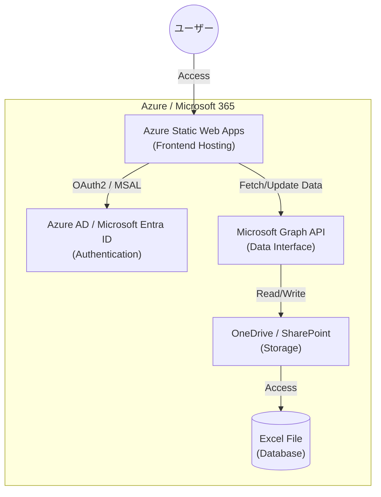
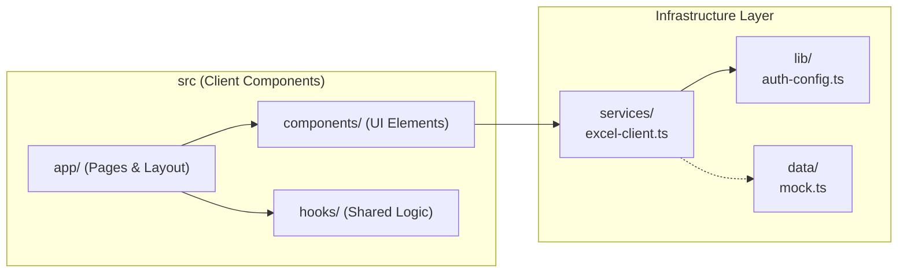

# limit-pacer アーキテクチャ解説

「limit-pacer」は、Next.jsをフロントエンドに採用し、Microsoft 365エコシステム（Azure AD, OneDrive Excel, Graph API）をフル活用したモダンなWebアプリケーションです。

## 1. システム全体構成図
本アプリは「Azure Modern Web App」パターンを採用しており、サーバーレスかつ低コストな構成となっています。

---

## 2. アプリケーション内部構成 (コンポーネント構造)
Next.jsのApp Routerアーキテクチャに基づき、各役割が明確に分離されています。

---

## 3. データフロー
### 認証フロー
1. ユーザーがアクセスし、`MSAL (Microsoft Authentication Library)` 経由でAzure ADへサインイン。
2. 取得した `AccessToken` を使用して、Microsoft Graph APIへのリクエストを認可。

### データ管理フロー
本アプリは**Excelをデータベースとして使用**します。
- **読み込み**: Graph API経由でExcel内のテーブル（Members/Tasks）をJSONとして取得。
- **更新**: タスクの完了状態などを、セルの書き換え（PATCHリクエスト）としてExcelに反映。

---

## 4. 技術スタック

| 分類 | 技術名 | 備考 |
| :--- | :--- | :--- |
| **Frontend** | Next.js (React) | 高いパフォーマンスとSEO |
| **Styling** | Tailwind CSS | モダンでレスポンシブなデザイン |
| **Authentication** | Azure MSAL | Azure ADとのセキュアな統合 |
| **Backend API** | Microsoft Graph API | Microsoft 365データへのアクセス |
| **Database** | Excel (on OneDrive/SP) | 管理の容易さと既存資産の活用 |
| **Hosting** | Azure Static Web Apps | 高速なデプロイと無料枠の活用 |

---

## 5. 他のLLM/サービスへの依頼用プロンプト案
よりリッチな図解（プレゼン資料用など）を作成したい場合、以下のプロンプトを使用して他のAI（ChatGPT Canvas, Napkin.ai, Claude等）に依頼することをお勧めします。

### プロンプト例
> **タイトル**: Webアプリ「limit-pacer」の構成図作成依頼
>
> **概要**:
> 以下の技術構成を持つWebアプリケーションの構成図（システム構成図およびシーケンス図）を作成してください。
>
> **技術スタック**:
> - フロントエンド: Next.js (Tailwind CSS)
> - 認証: Azure AD (MSAL.js)
> - データベース: OneDrive上のExcelファイル
> - 通信: Microsoft Graph API
>
> **データフローの説明**:
> 1. ユーザーがNext.jsアプリにログイン（Azure AD認証）。
> 2. アプリがGraph APIを介してOneDrive上のExcelファイルからタスク一覧を読み込む。
> 3. ユーザーがタスクを完了すると、アプリがGraph APIを介してExcelの該当セルを更新する。
>
> **出力イメージ**:
> プレゼンテーション資料に使用するため、アイコン（Azure, Active Directory, Excel等）を用いた視覚的に分かりやすく、洗練されたデザインで作成してください。

---

> [!TIP]
> **図解作成に強いサービス例**:
> - **Napkin.ai**: テキストから瞬時に美しいフロー図や構成図を生成できる特化型サービス。
> - **ChatGPT (Canvas)**: 対話しながら図の微調整やデザインの変更が可能。
> - **Canva (Magic Media)**: プレゼン資料に馴染むグラフィカルな図を作成するのに最適。
